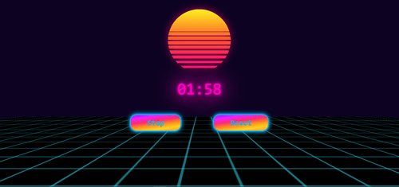

### To practice JS vanilla, I made this timer app

**Quick description:**
- code organization with js modules 
- configurable timer  
- ability to pause
- RetroWave design
- grid style: https://codepen.io/hugo/pen/eYZrOW 
- sun style: https://codepen.io/Sorskoot/pen/qBWpRea 
- no responsive design (wip)
- Wilhelm's cry to indicate the end of the timer ^^

